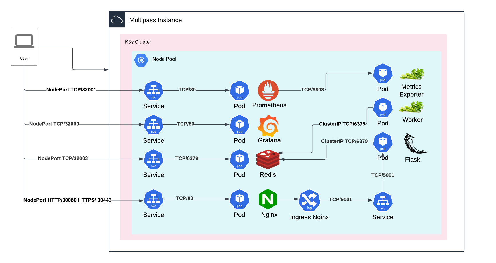
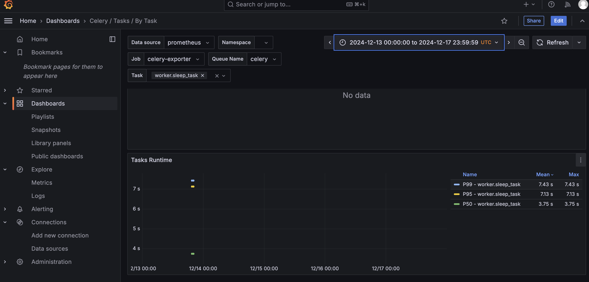
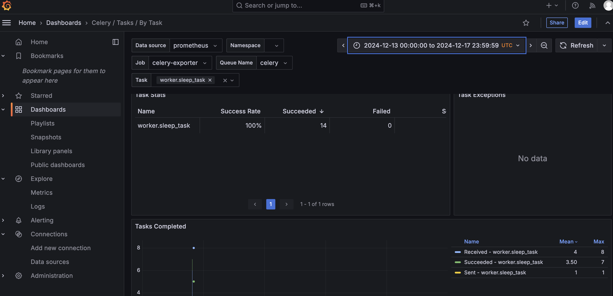
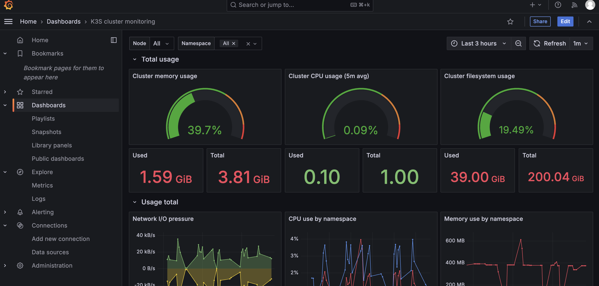
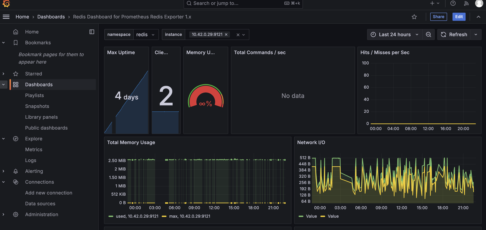

# northwood_devops_project

## **Overview**
This doc provides workflow to deploy a K3s Cluster on a Multipass Instance with infrastructure components and a Flask app with Celery Workers.  This workflow will only work if you are on a ARM64 architecture.  I tried to develop for AMD64 but that got too complex with the time I had.

## **Dashboards**
### **Celery Dashboard**




### **Cluster Monitoring**


### **Redis Dashboard**


## **Components**

### **1. Flask Application**
- A Python-based web application that serves requests and triggers Celery tasks.
- Exposed via an NGINX Ingress for external access.

### **2. Celery Workers**
- Background workers to process long-running tasks from the Flask app.
- Connected to a Redis broker for task queuing.

### **3. Redis**
- Acts as the message broker and result backend for Celery.

### **4. Celery Exporter**
- Exposes Prometheus metrics for Celery task events such as task runtime, successes, and failures.

### **5. NGINX Ingress Controller**
- Routes external traffic to the Flask app based on ingress rules.
- Configured to expose the application using a NodePort service or hostname.

### **6. Prometheus**
- Scrapes metrics from the Celery Exporter for monitoring and analysis.

### **7. Grafana**
- Visualizes metrics from Prometheus, including dashboards for Celery task performance.

## **Prerequisites**

1. **kubectl**
   - Required to manage and connect to the Kubernetes cluster.
   - [Install kubectl](https://kubernetes.io/docs/tasks/tools/#kubectl)

2. **Multipass**
   - Required to deploy a local Multipass instance for the Kubernetes cluster.
   - [Install Multipass](https://multipass.run/)

3. **Helm**
   - Required to deploy Helm charts from your local machine.
   - [Install Helm](https://helm.sh/docs/intro/install/)

4. **Docker**
   - Required to build and push Docker images for your components.
   - [Install Docker](https://docs.docker.com/get-docker/)

5. **ARM64 Machine**
   - The infrastructure and Docker images are designed and tested for ARM64 architecture.
   - Support for AMD64 was omitted due to project complexity.

---
## **Make Celery Container Deployment**
Python code for Flask app and Celery worker lives in [make_celery](https://github.com/dothinh316/make_celery). Please follow README.md instructions for build and deployment.  Currently there is a Github Actions workflow there to automate the build process from CI based on commit to `main` or a version tag

## **Design**
The Flask application serves two key endpoints:
1. `/` - Home endpoint
2. `/long_task` - Trigger a long running task

It is intended when a user hits `http://<Node-IP>:30080/long_task`, this will add a task to the broker, Redis. Then the Celery Worker will go and pick up that task to process.

## **Workflow**
1. Install Mutipass Instance - [multipass-k3s-setup](https://github.com/dothinh316/multipass-k3s-setup)
2. Expose the Cluster API via Multipass VM IP
K3s binds the cluster API to localhost by default. Update the configuration to expose it through the Multipass VM's IP:
* `vim /etc/systemd/system/k3s.service`
* Find the line with ExecStart and add the --bind-address and --advertise-address flags:
example:
```bash
    ExecStart=/usr/local/bin/k3s server \
    --bind-address=0.0.0.0 \
    --advertise-address=192.168.64.2 \
    --disable=traefik
```
*  `sudo systemctl daemon-reload`
*  `sudo systemctl restart k3s`
*  `scp ubuntu@<VM's IP>:/etc/rancher/k3s/k3s.yaml ~/k3s.yaml`
*  `vim ~/k3s.yaml `
* FIND AND REPLACE VM's IP
```bash
    clusters:
    - cluster:
        server: https://<VM's IP>:6443
        certificate-authority-data: <...>
```
* `export KUBECONFIG=~/k3s.yaml`
3. Deployments - Deploy Observability Pipeline with Helm From Local Machine
* Clone [deployments](https://github.com/dothinh316/deployments)
* cd into deployments repo and install required helm charts with the values file provided
### Grafana
* `helm repo add grafana https://grafana.github.io/helm-charts`
* `helm repo update`
* `kubectl create namespace grafana`
* `helm install grafana grafana/grafana --namespace grafana -f grafana-values.yaml`
* Connect to Grafana from your local machine http://<MULTIPASS_IP>:32000
### Prometheus
* `helm repo add prometheus-community https://prometheus-community.github.io/helm-charts`
*  `helm repo update`
* `kubectl create namespace prometheus`
* `helm install prometheus prometheus-community/prometheus --namespace prometheus -f prometheus-values.yaml`
* Connect to prometheus from your local machine http://<MULTIPASS_IP>:32001
### Redis
* `helm repo add bitnami https://charts.bitnami.com/bitnami`
*  `helm repo update`
* `kubectl create namespace redis`
* `helm install redis bitnami/redis --namespace redis -f redis-values.yaml`
* Connect to redis from your local machine http://<MULTIPASS_IP>:32003
### Nginx
* `helm repo add ingress-nginx https://kubernetes.github.io/ingress-nginx`
* `helm repo update`
* `kubectl create namespace ingress-nginx`
* `helm install nginx-ingress ingress-nginx/ingress-nginx nginx-values.yaml`
### Celery
* `cd celery_helm`
* `helm install celery -f values.yaml .`
* Connect to flask app / celery worker from your local machine http://<MULTIPASS_IP>:30080/ or http://<MULTIPASS_IP>:30080/long_task
4. Dashboards for Deployments - Follow [this](https://grafana.com/docs/grafana/latest/dashboards/build-dashboards/import-dashboards/) to add pre build dashboards
* https://grafana.com/grafana/dashboards/15282-k8s-rke-cluster-monitoring/
* https://grafana.com/grafana/dashboards/17508-celery-tasks-by-task/
* https://grafana.com/grafana/dashboards/763-redis-dashboard-for-prometheus-redis-exporter-1-x/
